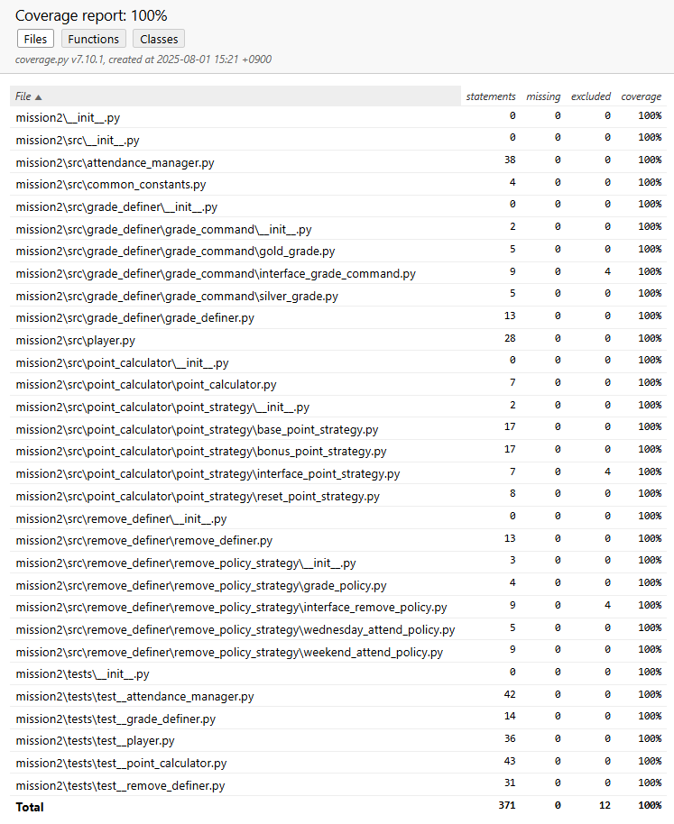

<table>
  <tr>
    <td colspan="2"> 요구사항 체크리스트 </td>
  </tr>
  <tr>
    <td> D1 </td>
    <td> O  </td>
    </tr>
<tr>
    <td> D2 </td>
    <td> O  </td>
    </tr>
<tr>
    <td> D3 </td>
    <td> O  </td>
    </tr>
<tr>
    <td> D4 </td>
    <td> O  </td>
    </tr>
<tr>
    <td> D5 </td>
    <td> O  </td>
    </tr>
</table>

